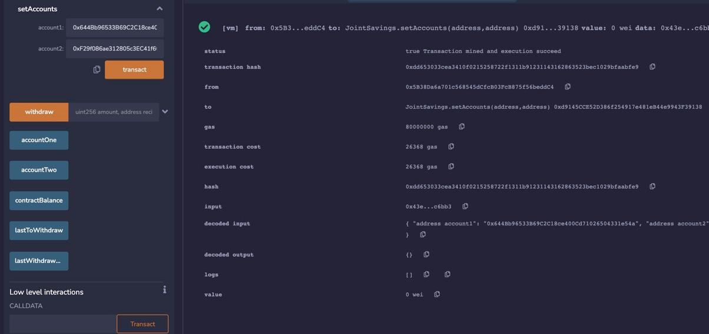
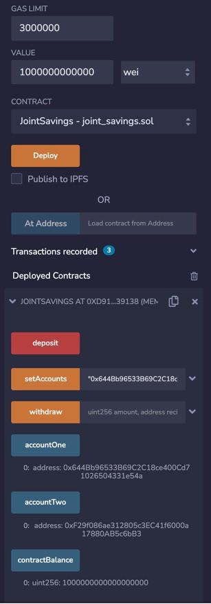
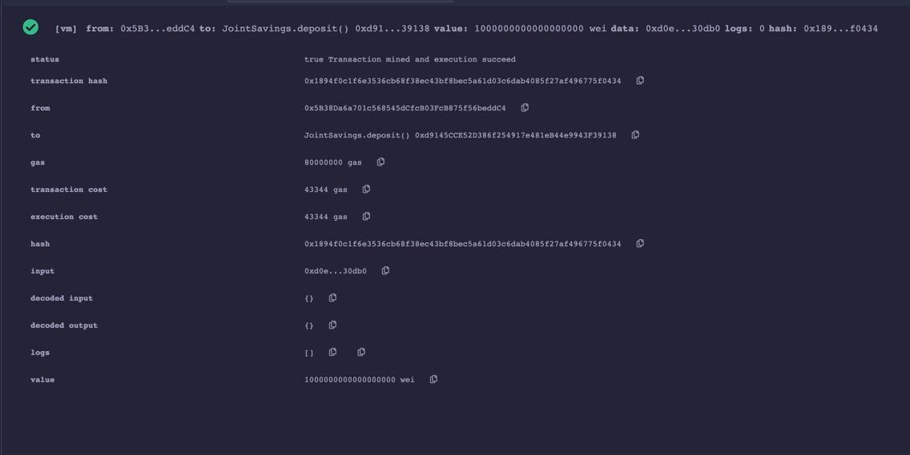
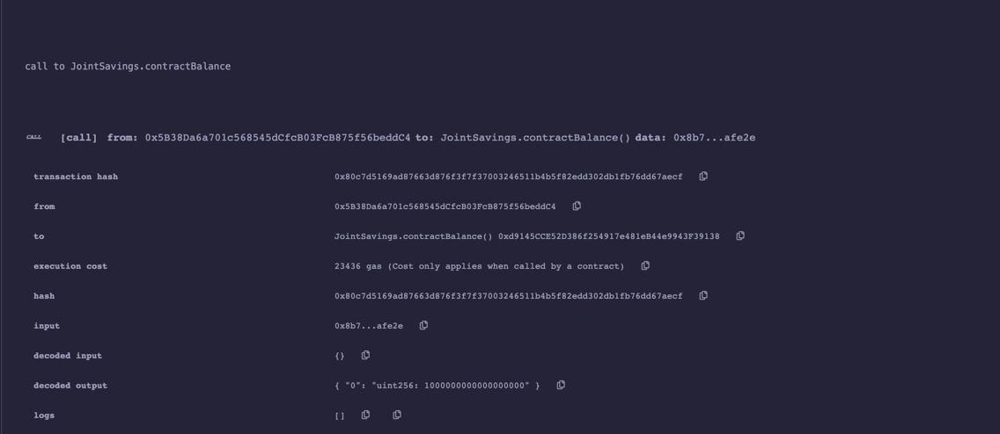
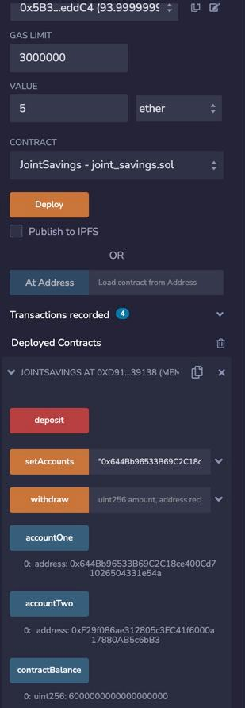
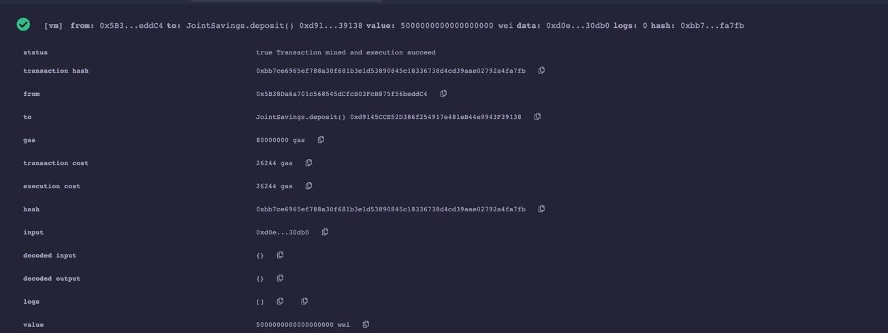
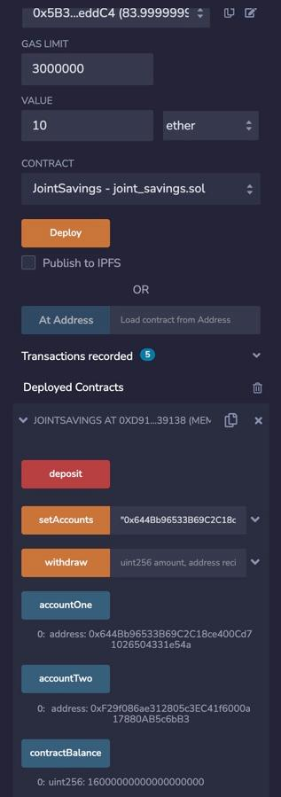
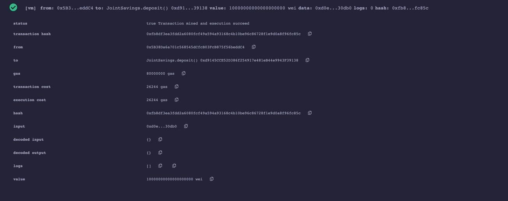

# Join-savings-account-
Smart contract 
## Succesfull Compliation 

## Set the account1 and account2

## Transaction one send 1 ether

## Transaction two send 5 ether

## Transaction three send 10 ether

