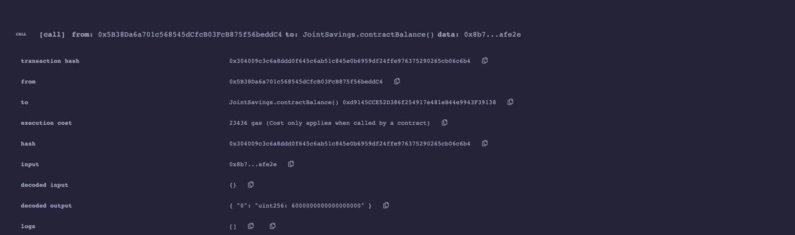

# Join-savings-account-
Smart contract by Solidity 
## Succesfull Compliation 

## Set the account1 and account2

## Transaction one send 1 ether

## Transaction two send 5 ether

## Transaction three send 10 ether

## set the withdrawal to account one 5 ether and contract balance after withdraw

## seth the withdrawal to account 2 10 ether and contract balance after withdraw

## last to withdraw screenshot

## last to withdraw amount screenshot

